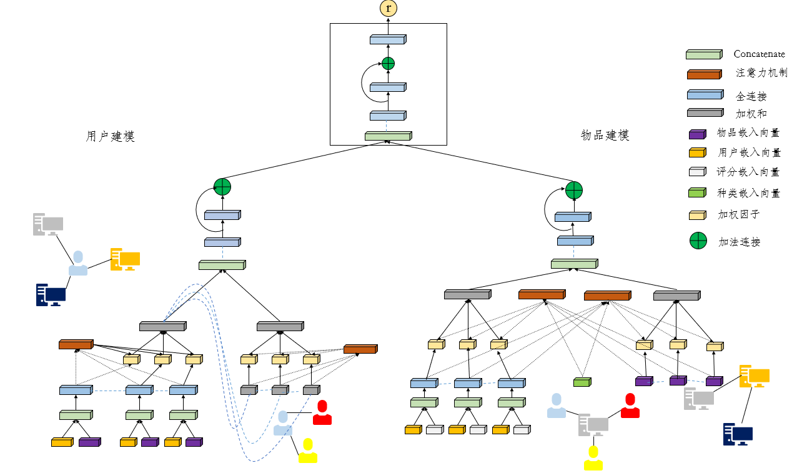

# GraphRecPlus
GraphRec [ref link](https://github.com/wenqifan03/GraphRec-WWW19)

My model

1. I change some fully connected network into the ResNet
2. I add the catagory information within the items
3. I use the cross attention to get the better weighted index with the Item
My model decreases the RMSE & MAE loss approximately 2%, 11%, 16%.
